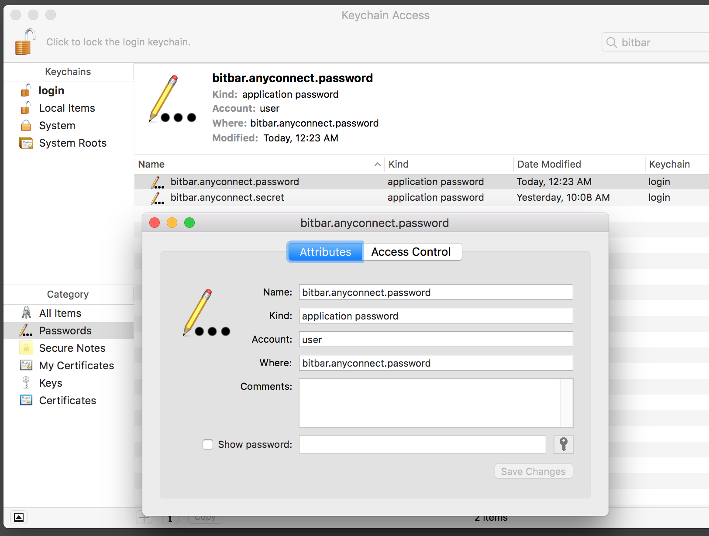
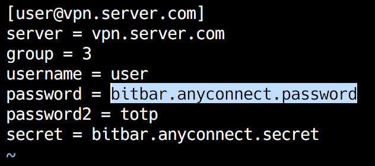

# bitbar-anyconnect
BitBar plugin to control AnyConnect VPN

Dependencies:

1. **pyexpect**

    This pluging uses **Cisco VPN client** to connect to a private
    network. Communication to a client executable is organized using
    **pyexpect** library.

2. **pyotp**

    It is possible to use time based one time passwords if MFA is
    requirred by a server. The *password2d* profile property can be
    configured as *topt* and the *secret* property is expected to
    contain the ID for OTP secred stored in the keychain.

## Profiles
Provide profile details in *~/.bitbar_anyconnect/profiles.ini* to be able to
connect with your credentials.

Please notice that sensitive data are not stored in the *profiles.ini*. The
plugin relies on **Keychain Access** to read passwords and secrets. A typical
configuration workflow is:

1. Add your password to **Keychain Access**

    

2. Add password ID to *profiles.ini*

    

3. Allow access *security* tool to read the added credentials like:

    ```
    $ /usr/bin/security find-generic-password -ws bitbar.anyconnect.password
    PASSWORD

    ````
